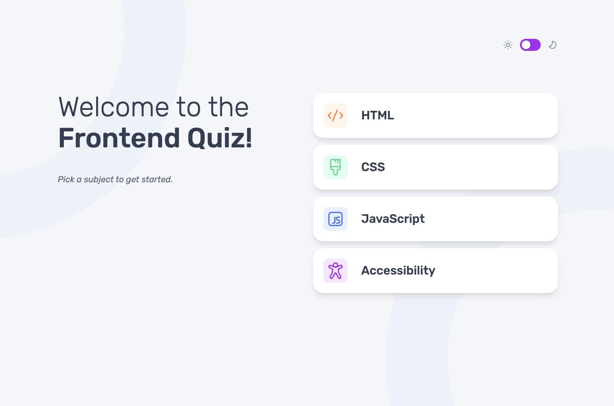

# Frontend Mentor - Frontend quiz app solution

This is a solution to the [Frontend quiz app challenge on Frontend Mentor](https://www.frontendmentor.io/challenges/frontend-quiz-app-BE7xkzXQnU).

## Table of contents

- [Overview](#overview)
  - [The challenge](#the-challenge)
  - [Screenshot](#screenshot)
  - [Links](#links)
- [My process](#my-process)
  - [Built with](#built-with)
  - [What I learned](#what-i-learned)
- [Author](#author)

## Overview

### The challenge

Users should be able to:

- Select a quiz subject
- Select a single answer from each question from a choice of four
- See an error message when trying to submit an answer without making a selection
- See if they have made a correct or incorrect choice when they submit an answer
- Move on to the next question after seeing the question result
- See a completed state with the score after the final question
- Play again to choose another subject
- View the optimal layout for the interface depending on their device's screen size
- See hover and focus states for all interactive elements on the page
- Change the app's theme between light and dark

### Screenshot



### Links

- Solution URL: [GitHub repository](https://github.com/samulikn/quiz-app)
- Live Site URL: [Live site](https://samulikn.github.io/quiz-app)

## My process

### Built with

- Semantic HTML5 markup
- CSS custom properties
- Flexbox
- Mobile-first workflow
- [React](https://reactjs.org/) - JS library
- [TypeScript](https://www.typescriptlang.org/)
- [Tailwind CSS](https://tailwindcss.com/)
- [Vite](https://vite.dev/)

### What I learned

I learned how to set up and develop a project using React with TypeScript, Vite, and Tailwind CSS and deploy it to gitHub pages. I practiced applying styles conditionally based on component state. For example, I used template literals to dynamically assign Tailwind classes:

```Tailwind CSS
className={`p-4 bg-white ${styles.ring} ...`}
```

## Author

- Website - [Nataliia](https://natashobotova.onrender.com)
- Frontend Mentor - [@samulikn](https://www.frontendmentor.io/profile/samulikn)

